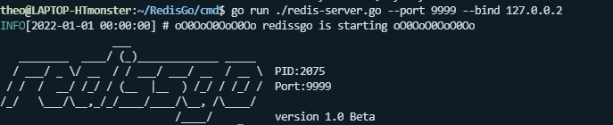

<!--
 * @Description: 
 * @Autor: HTmonster
 * @Date: 2022-01-28 10:25:09
-->
# redissgo


`redissgo` is a Redis-server that is implemented by Golang.

# Run
```shell
./redis-server
./redis-server --port 3000 --bind 127.0.0.1
./redis-server /etc/redis/redis.conf
```


# Design and implementation

## Datastruct

### Underlying datastruct difference

| redis | redissgo|Note|
|-------|---------|----|
|SDS(Simple Dynamic String)| build-in `string`(byte slice)||

